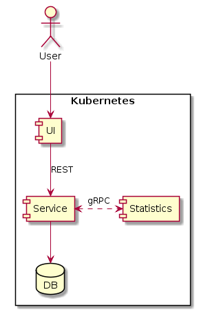

# playground-polyglot-micropost

This is a playground project to learn some previously unused technologies such as Micronaut, Kotlin, Jooq, gRPC, Golang, React, Kubernetes

This project will contain 3 service:
- micropost-service: a Rest (Hal) service what will manage users, microposts and micropost statistics computed by 
`micropost-statistics` service (using Micronaut 1.2.7, Kotlin 1.2.61 on JDK 8, Jooq 3.10.4, gRPC)
- micropost-statistics: a simple Go service to compute some statistics of a micropost (using Golang 1.11, gRPC)
- micropost-ui: a frontend for managing micropost (using React 16.12.0 with TypeScript 3.7.2 on Node 13.3.0)

The services will be deployed to Kubernetes (1.15.0) and must be able for: service-discovery, self-healing, rolling upgrade



<br/>
<br/>


## Set-up

1. Run `./setup.sh` to set up local kubernetes cluster and application infrastructure.  
    The following steps are performed:
    - install Kubernetes in Docker cluster (Kind) with 2 worker nodes
    - start Docker containers for database and Adminer
    - build Docker images for applications and load them into Kind

2. After running the setup script don't forget to export Kind kubeconfig to connect the cluster with Kubectl
    ```bash
    export KUBECONFIG="$(kind get kubeconfig-path --name="kind")"
    ```

    > Adminer is available on `localhost:9000`. Connect to the server by using the host machines IP address (`hostname I`).

3. Deploy pods, services and ingress from the `kubernetes` folder:
    ```bash
    kubectl apply -f deployment.yml
    kubectl apply -f service.yml
    kubectl apply -f ingress.yml
    ```

    > Unfortunately ingress does not work properly with Kind, so you have to port-forward micropost-service and micropost-ui 
    if you would like to interact with it over localhost:
    ```bash
    kubectl port-forward <micropost-service-pod> 8010
    kubectl port-forward <micropost-ui-pod> 3000
    ```

<br/>

[](files/micropost-demo.mp4)
<br/>
<br/>


## Rolling upgrade

To check rolling upgrade you need to create or tag new images and load them to Kinnd:
```bash
docker tag domahidizoltan/micropost-service:kind domahidizoltan/micropost-service:kind2
docker tag domahidizoltan/micropost-statistics:kind domahidizoltan/micropost-statistics:kind2
kind load docker-image domahidizoltan/micropost-service:kind2
kind load docker-image domahidizoltan/micropost-statistics:kind2
```

You should see something similar when you get the pods:
```bash
➜  kubernetes git:(master) ✗ kubectl get pods
NAME                                    READY   STATUS    RESTARTS   AGE
micropost-service-58fc57bdcf-958lt      1/1     Running   0          3m8s
micropost-statistics-596cfd8554-hd22h   1/1     Running   0          3m8s
micropost-statistics-596cfd8554-rhplz   1/1     Running   0          39s
```

Replace the image names in the deployment file, and apply it. If you watch the pods you should see them replacing one by one:
```bash
➜  kubernetes git:(master) ✗ kubectl get pods -w
NAME                                    READY   STATUS              RESTARTS   AGE
micropost-service-58fc57bdcf-958lt      1/1     Running             0          4m59s
micropost-service-784884f5d5-vcn92      0/1     ContainerCreating   0          1s
micropost-statistics-596cfd8554-hd22h   1/1     Running             0          4m59s
micropost-statistics-596cfd8554-rhplz   0/1     Terminating         0          2m30s
micropost-statistics-6787c9c688-bbqgm   0/1     Pending             0          1s
micropost-statistics-6787c9c688-tmv2l   0/1     Pending             0          1s
micropost-service-784884f5d5-vcn92      0/1     Running             0          2s
micropost-statistics-596cfd8554-rhplz   0/1     Terminating         0          2m37s
micropost-statistics-596cfd8554-rhplz   0/1     Terminating         0          2m37s
micropost-statistics-6787c9c688-tmv2l   0/1     Pending             0          8s
micropost-statistics-6787c9c688-tmv2l   0/1     ContainerCreating   0          8s
micropost-statistics-6787c9c688-tmv2l   0/1     Running             0          10s
micropost-service-784884f5d5-vcn92      1/1     Running             0          13s
micropost-service-58fc57bdcf-958lt      1/1     Terminating         0          5m11s
micropost-statistics-6787c9c688-tmv2l   1/1     Running             0          19s
micropost-statistics-596cfd8554-hd22h   1/1     Terminating         0          5m17s
micropost-statistics-596cfd8554-hd22h   0/1     Terminating         0          5m18s
micropost-statistics-596cfd8554-hd22h   0/1     Terminating         0          5m26s
micropost-statistics-596cfd8554-hd22h   0/1     Terminating         0          5m26s
micropost-statistics-6787c9c688-bbqgm   0/1     Pending             0          28s
micropost-statistics-6787c9c688-bbqgm   0/1     ContainerCreating   0          28s
micropost-statistics-6787c9c688-bbqgm   0/1     Running             0          29s
micropost-statistics-6787c9c688-bbqgm   1/1     Running             0          40s
micropost-service-58fc57bdcf-958lt      0/1     Terminating         0          5m42s
micropost-service-58fc57bdcf-958lt      0/1     Terminating         0          5m42s
micropost-service-58fc57bdcf-958lt      0/1     Terminating         0          5m46s
micropost-service-58fc57bdcf-958lt      0/1     Terminating         0          5m46s
```

When all pods are replaced you should see the new pods:
```bash
➜  kubernetes git:(master) ✗ kubectl get pods
NAME                                    READY   STATUS    RESTARTS   AGE
micropost-service-784884f5d5-vcn92      1/1     Running   0          66s
micropost-statistics-6787c9c688-bbqgm   1/1     Running   0          66s
micropost-statistics-6787c9c688-tmv2l   1/1     Running   0          66s
```

Pods are also recreating if you delete them or when they crash.

<br/>
<br/>


## Clean-up

Delete the resources and the cluster by using the commands below:

```bash
kubectl delete -f ingress.yml
kubectl delete -f service.yml
kubectl delete -f deployment.yml
kind delete cluster
```
